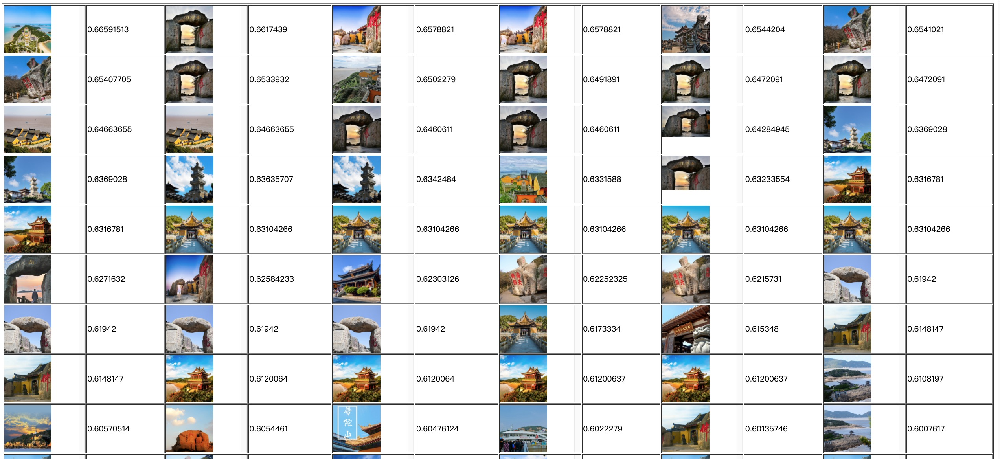
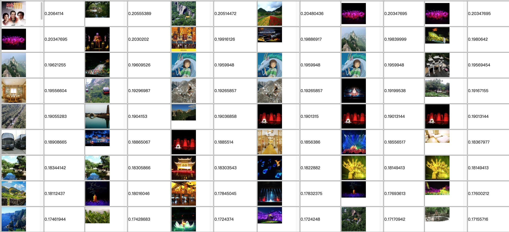

### 1. Introduction
Code for paper《Image Selection for Travel Products Recommendation with Multi-modal Knowledge Graph》. 

Including datasets，pretrained model with weights and AVAS model.

### 2. MKG based pre-trained model

#### 2.1 Dataset
`src/pretrain_model_test_dataset.csv` includes 1k images of 100 hot POI which is described in the paper.
You should download the image using the url by yourself.

#### 2.2 Quick Start
```commandline
pip install -r requirements.txt
cd demo
python3 align_model_test_with_mkg.py
```

- `demo/align_model_test_with_mkg.py`     # the demo test file
- `model/image/align_model_with_MKG.py`   # the model structure file
- `src/`   # test images
- `weights/`    # weights of pretrained model encoders and Bert config

The demo test file `align_model_test_with_mkg.py` will load the encoders weight and calculate the relevant score between the
text and the images. Then it will save the results to file `align_普陀山图片_with_MKG.csv`. You can learn more from the python file
and feel free to edit it.


- Visualizaiton of text-image retrieval. The higher score denotes the image is more relevant to the POI.

  


We can find that the low score images are irrelevant to the POI '普陀山'。


### 3. AVAS
We are formatting the code and will release soon.